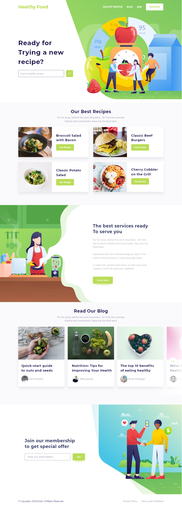

Desafio de código front-end.

Foi solicitado:

1- Desenvolver o site de acordo com o design abaixo utilizando ReactJS.  
2- O site tem que ser 100% responsivo, iremos avaliar bem a responsividade.  
3- Criar a tela de cadastro baseada na tela inicial, o cadastro precisa receber os dados abaixo:  

  a. Nome

  b. Data de nascimento

  c. CPF

  d. CEP

    - Utilizar a API dos correios para preencher os demais campos que compõe o endereço.

  e. Validação dos campos

  f. Armazenar os dados do formulário no local storage e Cookies

* Não precisa utilizar banco de dados.

Para executar a aplicação, clonar o repositório e executar "npm-start" no terminal. 

Para acessar o site, clique no link

https://healthy-food-app.netlify.app/

Abaixo o design utilizado de referência para a construção da página.

